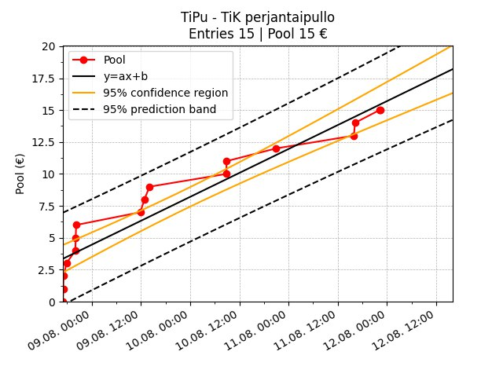

# Kipu Grapher 🍌

Telegram bot to graph friday bottle raffle progress. Currently supports graphing the raffle pool and expected values 📣

## Getting Started

Add the bot on [Telegram](https://t.me/NoPainNoGraphbot) into your group and enjoy!

**Watch the chart climb as you reach the raffle end date!** 📈

**Descend into sadness when every entry is the minimum amount and the expected value stays zero** 😔

## Developing KipuBot

### Basic

Using [pipenv](https://pipenv.pypa.io/en/latest/):

1. Set `PYTHONPATH=${PYTHONPATH}:kipubot` in .env
2. Set `BOT_TOKEN` in .env
3. Set `DATABASE_URL` in .env
4. pipenv install --dev
5. pipenv run init
6. pipenv run dev

### Docker

(Requires that the database is initialized)

1. docker build -t [image_name] .
2. docker run -e "BOT_TOKEN=???" -e "DATABASE_URL=???" [image_name]
