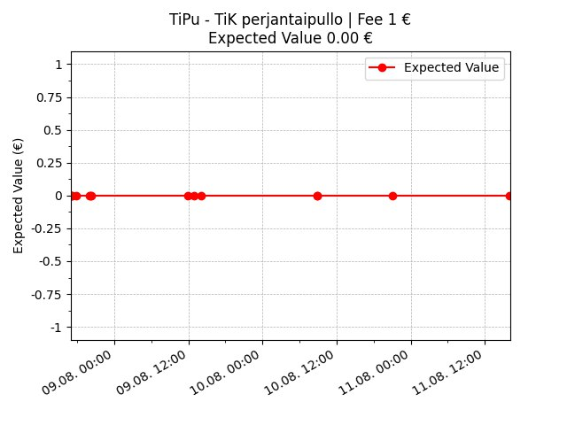

# Kipu Grapher 🍌

Telegram bot to graph friday bottle raffle progress. Currently supports graphing the raffle pool and expected values 📣

## Getting Started

Add the bot on [Telegram](https://t.me/NoPainNoGraphbot) into your group and enjoy!

**Watch the chart climb as you reach the raffle end date!** 📈

**Descend into sadness when every entry is the minimum amount and the expected value stays zero** 😔

## Developing KipuBot

### Docker (Recommended)

1. Set `BOT_TOKEN` in .env
2. `docker compose -f docker-compose.dev.yml up`

### Poetry

Using [poetry](https://python-poetry.org/docs/):

2. Set `BOT_TOKEN` in .env
3. Set `DATABASE_URL` in .env
4. poetry install
5. poetry run poe dev
